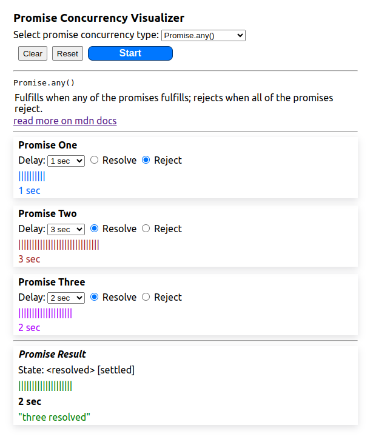

# JavaScript Promise Concurrency Visualizer

## Overview

The JavaScript Promise Concurrency Visualizer is a fun and educational project that helps you understand how JavaScript promises work under the hood, particularly when dealing with concurrency. It visualizes the outcomes of multiple promises executing concurrently using methods like `Promise.all`, `Promise.race`, `Promise.any`, and `Promise.allSettled`.

## Features

- **Interactive Visualizations**: See promises in action with real-time visualizations.
- **Multiple Methods Supported**: Explore outcomes of promises using various concurrency methods.
- **Educational**: Gain a deeper understanding of JavaScript promises and concurrency.
- **Easy to Use**: Simple interface for effortless exploration.

## Live Demo

Check out the live demo [here](https://js-promise-vis.netlify.app/).

## Getting Started

To get a local copy up and running follow these simple steps:

1. Clone the repository.
2. Open `index.html` in your preferred browser.

## Contributing

While this project may be small in scope, contributions are always welcome! If you have any suggestions or spot any issues, feel free to open an issue or submit a pull request. Even small improvements can make a difference! For major changes, please open an issue first to discuss your ideas.

## Feedback

I'd love to hear your feedback! If you have any suggestions or ideas to improve this project, feel free to reach out or open an issue.

## Try It Yourself

Want to experiment with the code or make some changes? Click [here](https://stackblitz.com/~/github.com/yamsun/Javascript-promise-concurrency-visualizer) to edit the project in StackBlitz's next-generation editor ⚡️.

## Acknowledgements

This project was inspired by [Tapas Adhikary's #PromiViz](https://promiviz.vercel.app/).

## License

Distributed under the MIT License. See `LICENSE` for more information.
